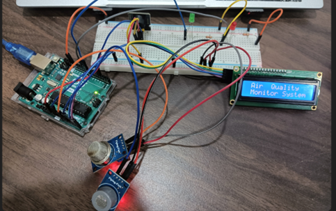

# Smart-Air-Quality-Monitoring-System

# Introduction
This is a simple Air Quality Monitoring System based on these two sensors :

* MQ135(smoke/gas)
* MQ-7(carbon monoxide)

A buzzer and couple of LEDS are used to indicate the severity of the situation with LCD giving detailed information about surrounding air quality. 

# Arduino & Electronic schematic.

The schematic diagram shows the connections between the Arduino board, the LCD 
display, the gas sensor, and the alarm components (buzzer and LEDs). 

# Sequence Diagram

# Screenshots

